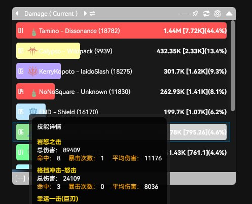

# 🌟 Star Resonance Toolbox

[](https://www.gnu.org/licenses/agpl-3.0.txt)

[🇨🇳 Chinese](README.md)

This project’s core data extraction and analysis modules are adapted from the [StarResonanceDamageCounter](https://github.com/dmlgzs/StarResonanceDamageCounter) project.
Special thanks to the original author for their great work and support.

The tool **does not modify or inject into the game client** and **does not violate the game’s Terms of Service**.
Its purpose is to help players better understand combat data, identify inefficiencies, and improve gameplay experience through informed optimization.

Before using, please ensure that your use of this tool and its data does **not contribute to toxicity, player discrimination, or any harmful behavior within the community**.


---

## 🚀 Quick Start

### Prerequisites

* [.NET 8.0 SDK](https://dotnet.microsoft.com/en-us/download/dotnet/8.0)
* Windows 10 or later

### Build & Run

1. Clone this repository:

   ```bash
   git clone https://github.com/yourusername/StarResonanceToolBox.git
   cd StarResonanceToolBox
   ```
2. Build:

   ```bash
   dotnet build -c Release
   ```
3. Run:

   ```bash
   dotnet run --project StarResonanceDpsAnalysis.WPF
   ```

### Features

* ✅ Real-time combat data analysis
* 📊 Performance tracking and visualization
* 🔍 Class-specific damage breakdowns
* ⚙️ Customizable UI and chart settings
* 💾 Local data storage for long-term trend analysis

*(More features are under active development!)*

### Screenshots



---

## 📄 License

[](LICENSE.txt)

This project is licensed under the **GNU Affero General Public License v3**.
By using or contributing to this project, you agree to the terms of this license.

We **do not welcome** those who take open-source code, modify it, and release it as **closed-source** without compliance with the license.
Open source should stay open.

---

## 👥 Contributing

Contributions are always welcome!
If you’d like to help improve the project:

* Open an [Issue](../../issues) for bug reports or suggestions
* Submit a [Pull Request](../../pulls) with enhancements or fixes

Before contributing, please make sure your code follows the project’s structure and respects the AGPL license.

---

## ⭐ Support the Project

If this project helped you, consider giving it a **Star ⭐** on GitHub!
Your support encourages further development and new features.

---

## ⚠️ Disclaimer

This tool is provided **for educational and analytical purposes only**.
It must not be used for cheating, automation, or any activity that violates the game’s Terms of Service.

Users are solely responsible for how they use the tool.
The developers are **not liable** for any misuse or toxic behavior resulting from others’ interpretation of its data.

Please use responsibly and help maintain a positive, fair community environment.
